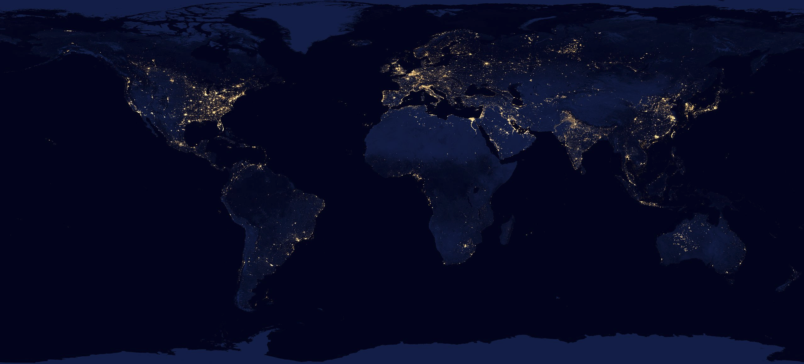

# Earth at Night in HD: Predicting High-Resolutions Nighttime Radiance from Daytime Satellite Imagery
Isaiah Lyons-Galante  
University of Colorado Boulder

The imprint of human activity on Earth has become unmistakable, offering a unique vantage point for population studies through the lens of space. Access to global high-resolution datasets, such as Landsat(1), has been made possible for the public through platforms like Google Earth Engine (3). These datasets open a window to observe and analyze human settlements, providing invaluable insights into the dynamics of our changing world. The image below is from Google Earth, showing the twin cities of Brazzaville and Kishasa on the banks of the Congo River. One can clearly see the densely package settlements on the banks, along with the unpopulated islands in the river.

During the night, human presence becomes even more apparent as settlements cast a faint glow into space. This nocturnal illumination is captured by the VIIRS instrument aboard the Suomi National Polar-orbiting Partnership (NPP) satellite. Despite its significance, the relatively weak signals limit the resolution to about 500 meters squared. This limitation poses a challenge to extracting fine-grained information about the distribution and characteristics of human settlements. The image below is of the same area as the one above, but at night. The resolution is significantly lower, with the pixels clearly visible, while the island in the river is completely dark.

Compelling research underscores the correlation between night lights and mean household wealth, as measured by ground surveys. This correlation establishes night lights as a proxy for gauging livelihoods, making them a valuable tool for socio-economic analyses. This becomes particularly crucial in regions like Sub-Saharan Africa, where traditional population surveys are sparse. The scarcity of on-the-ground data highlights the potential of night lights as a surrogate measure for understanding the economic landscapes of communities. The graph below shows the relationship between night lights and mean household wealth in Sub-Saharan Africa. The data is from the Demographic and Health Surveys (DHS) Program, which conducts household surveys in developing countries. The graph shows a clear correlation between night lights and mean household wealth.

The demand for higher-resolution night lights becomes evident when considering the need for detailed impact assessments. Such assessments can unravel the intricate ways in which individual communities are affected by economic development programs or global events. As technology advances, the quest for sharper and more detailed night light data gains significance, promising to enhance our understanding of human settlements and socio-economic patterns on a global scale. One example of this comes from a paper in Nature just last year that use wealth maps to assess the economic impact of access to electricity. High resolution nightlights would open up even finer grained analysis.

Embarking on this exploration of human settlements and socio-economic patterns, I employ cutting-edge methodologies to surmount the resolution challenges posed by existing night light data. Leveraging the power of machine learning, my approach involves training a model to predict night lights from high-resolution daytime imagery. By undertaking this innovative process, I aim to transcend the limitations of the existing data and generate high-resolution nighttime imagery. This fusion of technological advancements with geospatial analysis not only promises to enrich our understanding of human settlements but also sets the stage for a more nuanced examination of the impact of economic development programs and global events on individual communities. This notebook will serve as a guide for the entire process, from method design to model training and evaluation, and finally, the results and conclusions. The code is available on [GitHub](https://github.com/isaiahlg/csci5922/blob/main/proj/unet_regression_virrs.ipynb).
